Note: still under development

## Collaborators:

- Cesar Orozco Zamora. 
- Megan Madrigal Amador. 
- Johan Bastos Zamora. 


# Case Scenario: Unicorns and monocycles

based on: https://github.com/RMHogervorst/unicorns_on_unicycles

# Description

The main purpose is to tidy sales and observations tables, get insights and create a story to answer questions.

The tables are about the population of unicorns and the sales of monocycles (yes I know!). As the original author described:

> His work contains multiple tables, carefully written down, documenting the population of unicorns over time in multiple places and related to that the sales and numbers of unicycles in those countries.

and also:

> This 'raw' data gives us a nice example of typical dirty data you would find in the wild. The goal is to combine the sales data of unicycles and the populations of unicorns into a single 'tidy' dataframe.

Tables are:
- Sales
- Observations

Everything is from 17th century, taking place in five countries: Austria, Germany, France, Switzerland , Netherlands.

# Questions

1. Is there any correlation between sales of monocycles and the presence of unicorns?
2. How is the trend of bikes vs the number of unicorns. Growing, slowing down?
3. What is the population and bikes evolution? The evolution of turnover over time.
4. What is the country with more sales given presence of unicorns? Bigger number of bikes and turnover? With less sales?
5. Why the given correlation is not a spurious correlation?


# Analisys

* All code comes from data.R and main.R. Running main.R should be enough.

1. Is there any correlation between sales of monocycles and the presence of unicorns?

2. How is the trend of bikes vs the number of unicorns. Growing, slowing down?

```
scatterPlotFacetCountries <- function(){
  #### scatterplot  all bikes and pop by country  facet_wrap  
  obs_sales_contries <<- observations %>%
    left_join(bike_sales)
  obs_sales_contries %>%
    ggplot(.) + 
    geom_point(mapping = aes(x = pop, y = bikes)) + 
    facet_wrap(~ name_of_country, nrow = 2)  
}
```


The facet above pictures the correlation for 5 countries in terms of population vs number of bikes. The evolution is positive.

- - -
```
scatterPlotLinearPlotCorrelation <- function(){
  # scatterplot bikes vs population linear plot correlation
  #  trend line for all countries:   unicorn population vs number of bikes
  pop_bikes_turn <<- observations %>% # create pop_bikes_turn table with joins
    left_join(bike_sales) %>%
    left_join(bike_turnover)
  pop_bikes_turn %>%
    ggplot(.) + 
    geom_point(mapping = aes(x = pop, y = bikes)) +
    geom_smooth(mapping = aes(x = pop, y = bikes))
}
```

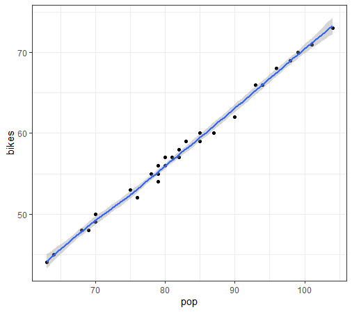

This plot shows the overoll behavior for the countries, even with some projection (shadow around the line). 
The slope is positive.

- - -
```
scatterPlotLinearPlotCorrelationColors <- function(){
  # scatterplot with trend line for all countries and with clustering colors: 
  #unicorn population vs number of bikes
  pop_bikes_turn %>%
    ggplot(., mapping = aes(x = pop, y = bikes)) + 
    geom_point(mapping = aes(color = name_of_country)) + 
    geom_smooth(data = filter(pop_bikes_turn)) 
}
```

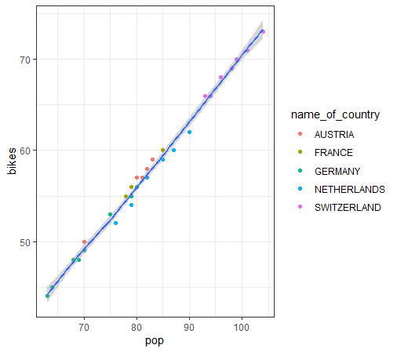


- - -

This one gives us how the countries have a tight up correlation, some has higher correlation than others.
This plot also gives us the final answer to question 2: How is the trend of bikes vs the number of unicorns. Growing, slowing down?
The trend is an increasing amount of bikes given an increasing amount of unicorns. 

```
correlationTable <- function(){
  ############### correlation pop and bikes
  # table with countries, correlation and total_turnover
  cor_turnover_countries <- obs_sales_contries %>% 
    group_by(name_of_country) %>% 
    summarize(correlation = cor(pop, bikes),
              total_population = sum(pop),
              total_bikes = sum(bikes)) %>%
    grid.table(.) 
}
```

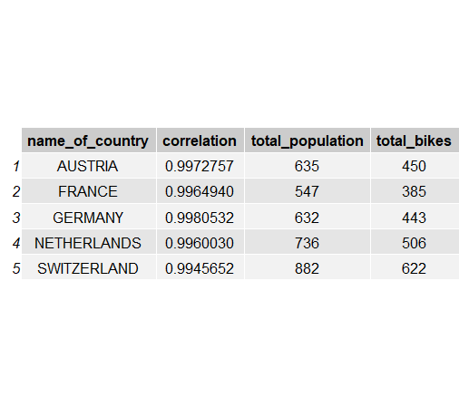

To finish the conversion on correlation (question number 1), this table summarize it. As we can see, correlation is almost 1, which means all countries have a strong bond in regards to population and the number of monocycles.

- - - 


```
linearPlotPopulationOverYearCountries <- function(){
  ###############   linear plot: population over years (sum of 5 countries)
  year_pop <<- obs_sales_contries %>% 
    group_by(year) %>% 
    summarize(population = sum(pop))
  
  # with better lines etc
  ggplot(year_pop, 
         aes(x = year, 
             y = population)) +
    geom_line(size = 1.5, 
              color = "lightgrey") +
    geom_point(size = 3, 
               color = "steelblue") +
    labs(y = "Population", 
         x = "Year",
         title = "Population over time",
         subtitle = "Austria, Switchland, Germany, Netherlands, ",
         caption = "Source:https://github.com/RMHogervorst/unicorns_on_unicycles")
}
```
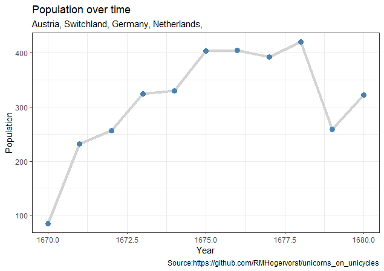

Now, we need to discuss question 3: What is the population and bikes evolution? The evolution of turnover over time.

As we can see, the graph represents the behavior of population over time (from 1670 to 1680). Although we have an increase, we do not know exactly why. Perhaps is because the data is incomplete, or maybe the population experience a decay due to a mortality? Let's see another graph. 

- - -

```
linearPlotBikesOverYearCountries <- function() {
  ###############   linear plot: bikes over years (sum of 5 countries)
  year_bikes <<- obs_sales_contries %>% 
    group_by(year) %>% 
    summarize(bikes = sum(bikes))
  
  # with better lines etc
  ggplot(year_bikes, 
         aes(x = year, 
             y = bikes)) +
    geom_line(size = 1.5, 
              color = "lightgrey") +
    geom_point(size = 3, 
               color = "steelblue") +
    labs(y = "Number bikes", 
         x = "Year",
         title = "Number bikes over time",
         subtitle = "Austria, Switchland, Germany, Netherlands, ",
         caption = "Source:https://github.com/RMHogervorst/unicorns_on_unicycles")
}

```
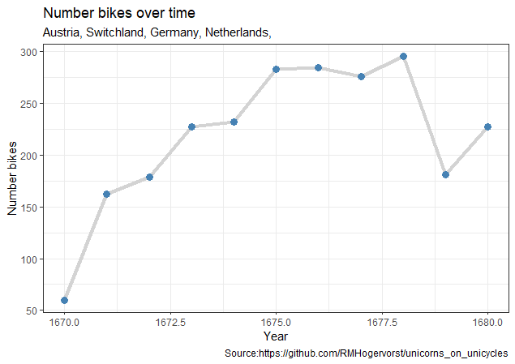

This graph is exactly the same as the graph above. Nevertheless, taking a closer look we see the y axis. The scale is bigger for population.
What is telling us? Over time the population and the number of monocycles is not just correlated by numbers, but also over time. 

That means the unicorns really like monocycles!

- - -

```
linearPlotPopYearAllCountries <- function(){
  ## for all countries population over year
  ggplot(data=obs_sales_contries, aes(x=year, y=pop, group=name_of_country, color=name_of_country)) +
    geom_line() + geom_point()+
    scale_color_brewer(palette="Paired")+
    theme_minimal()
}
```
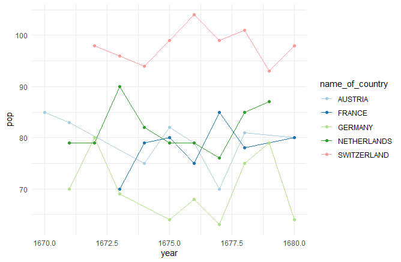

This plot pictures the population individually for every country. The same for the plot below, but with bikes. The lines are highly correlated. 
We see Switzerland and Germany at the top and the bottom of the graph. Are they with the highest and lowest values for population and number of bikes? Let's see the rest of the plots.

- - -


```
linearPlotBikesYearAllCountries <- function() {
  ## for all countries bikes over year
  ggplot(data=obs_sales_contries, aes(x=year, y=bikes, group=name_of_country, color=name_of_country)) +
    geom_line() + geom_point()+
    scale_color_brewer(palette="Paired")+
    theme_minimal()
}
```
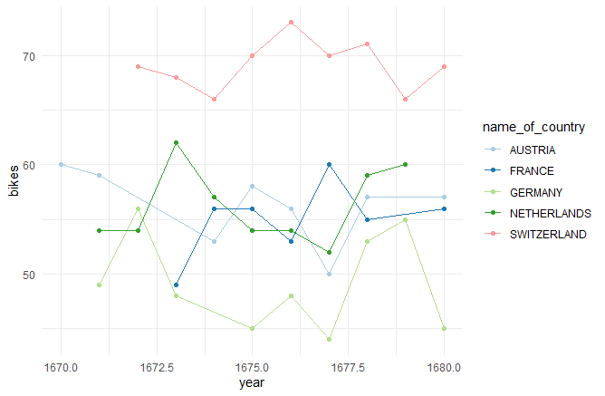


- - -
```
barPlotBikes <- function(){ ###################################
  ############### bar plot sales per  country and   
  sum_pop_bikes_country <<- obs_sales_contries %>% 
    group_by(name_of_country) %>% 
    summarize(bikes = sum(bikes),
              total_population = sum(pop),
              total_bikes = sum(bikes)
    )
  ggplot(data = sum_pop_bikes_country) +
    geom_bar(mapping = aes(x = name_of_country, y = total_bikes, fill=name_of_country), stat = "identity") +
    theme_minimal()
}
```

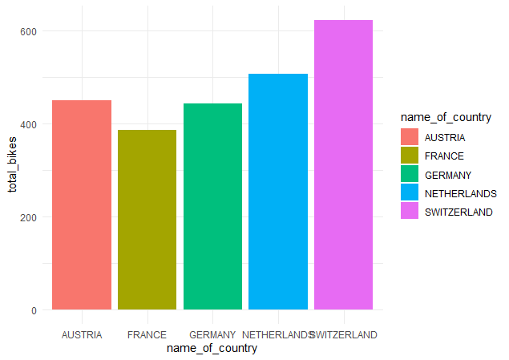

- - -

In this bar plot, we can easily see which country has the highest number of bikes for all years. As we mencioned, Switzerland historically had the highest amount of monocycles. Also, we can noticied that Germany is not at the bottom. It is France. If we take a second look at the plots above for the five countries, the problem with France is that it lacks of some information.

```
pieChartBikes <- function(){
  ###  generates tables with y position for pie chart
  sum_pop_bikes_country %>% 
    arrange(desc(name_of_country)) %>%
    mutate(total_population = ceiling(total_population / sum(sum_pop_bikes_country$total_bikes) *100)) %>%
    mutate(yposition = cumsum(total_bikes)- 0.5*total_bikes ) %>%
    ggplot(., aes(x="", y=total_bikes, fill=name_of_country)) +
    geom_bar(stat="identity", width=1, color="white") +
    coord_polar("y", start=0) +
    theme_void() + 
    #theme(legend.position="none") +
    geom_text(aes(y = yposition, label = total_bikes), color = "white", size=6) +
    scale_fill_brewer(palette="Set1") +
    ggtitle("Number of Bikes by country")  +
    labs(y = "Bikes", 
         x = "Year",
         title = "Bikes",
         subtitle = "Austria, Switchland, Germany, Netherlands, ",
         caption = "Source:https://github.com/RMHogervorst/unicorns_on_unicycles")
}
```
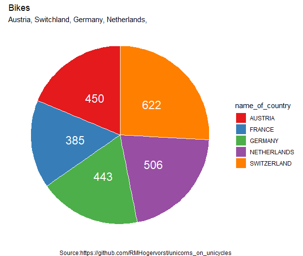

This is another representation of the same information (for the sake of rendering in a different way).  

- - - 


```
pieChartPopulation <- function(){
  ###  generates tables with y position for pie chart
  sum_pop_bikes_country <<- df_obs_sales %>% 
    group_by(name_of_country) %>% 
    summarize(bikes = sum(bikes),
              total_population = sum(population),
              total_bikes = sum(bikes)
    )  
  sum_pop_bikes_country %>% 
    arrange(desc(name_of_country)) %>%
    mutate(prop = ceiling(total_population / sum(sum_pop_bikes_country$total_population) *100)) %>%
    mutate(yposition = cumsum(total_population)- 0.5*total_population ) %>%
  ggplot(., aes(x="", y=total_population, fill=name_of_country)) +
    geom_bar(stat="identity", width=1, color="white") +
    coord_polar("y", start=0) +
    theme_void() + 
    #theme(legend.position="none") +
    geom_text(aes(y = yposition, label = total_population), color = "white", size=6) +
    scale_fill_brewer(palette="Set1") +
    ggtitle("Population by country") +
    labs(y = "Population", 
         x = "Year",
         title = "Population",
         subtitle = "Austria, Switzerland, Germany, Netherlands, France",
         caption = "Source:https://github.com/RMHogervorst/unicorns_on_unicycles")
}
```


This last pie chart confirms the assumtion that Switzerland and France are at the top and bottom of population and number of bikes. 

- - -
```
barPlotTurnoverByCountry <- function(){
  theme_set(theme_pubr())

  ggplot(data=df_sum, aes(x = total_turnover, y = name_of_country )) +
    geom_bar(fill = "#0073C2FF", stat = "identity") +
    geom_text(aes(label = c(total_turnover)), vjust = -0.3) + 
    theme_pubclean()
}
```

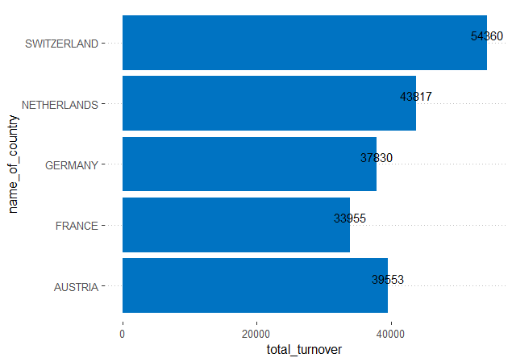

- - -

We wanted to know the turnover and the winner is Switzerland and at the bottom again is France. This confims again that the more Unicorns, the more monocycles were bought and the bigger the turnover.

So, this close the question 4: What is the country with more sales given presence of unicorns? Bigger number of bikes and turnover? With less sales?

This question is problematic, given the fact that some countries have gaps in years. Roughly speaking, as we could see in the linear plots before, Switzerland had the highest population. And given the tight correlation for question 1, highest amount of monocycles and total turnover.

Not the same for France. But as we mencioned, when we have a lack of information, we can not give assumptions, but perhaps create a model that predicts the missing outcome. 

For question 5. Why the given correlation is not a spurious correlation? 

First let's check what this is:

> In statistics, a spurious correlation (or spuriousness) refers to a connection between two variables that appears to be causal but is not. With spurious correlation, any observed dependencies between variables are merely due to chance or are both related to some unseen confounder.

So, the answer is not. Why. Question 1 answers that, not just by one country, but five. Also throughout an decade! 
At the end, we can say that monocyles and unicorns are not related. Given the evidence, they are. 


```
linerPlotCountryPopBikesTurnover <- function(country){
  df <-  df_obs_sales %>% 
    filter(name_of_country == country)
  ggplot() +
    geom_line(data=df, mapping = aes(x=year, y=total_turnover), color="blue") +
    geom_point(data=df, mapping = aes(x=year, y=total_turnover), color="blue") +
    geom_line(data=df, mapping = aes(x=year, y=population), color="orange") +
    geom_point(data=df, mapping = aes(x=year, y=population), color="orange") +
    geom_line(data=df, mapping = aes(x=year, y=bikes), color="green") +
    geom_point(data=df, mapping = aes(x=year, y=bikes), color="green") +
    labs(y = "Population", 
         x = "Year",
         title = "Turnover",
         subtitle = country,
         caption = "Source:https://github.com/RMHogervorst/unicorns_on_unicycles") +
    theme_bw()
} 


linerPlotCountryPopBikesTurnover("FRANCE")
linerPlotCountryPopBikesTurnover("SWITZERLAND")
```


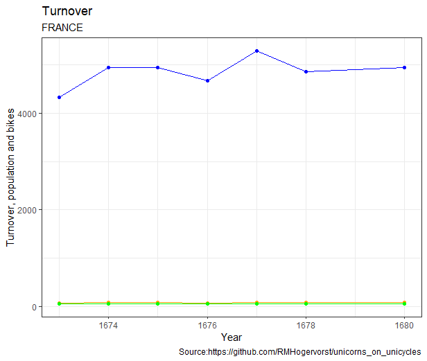

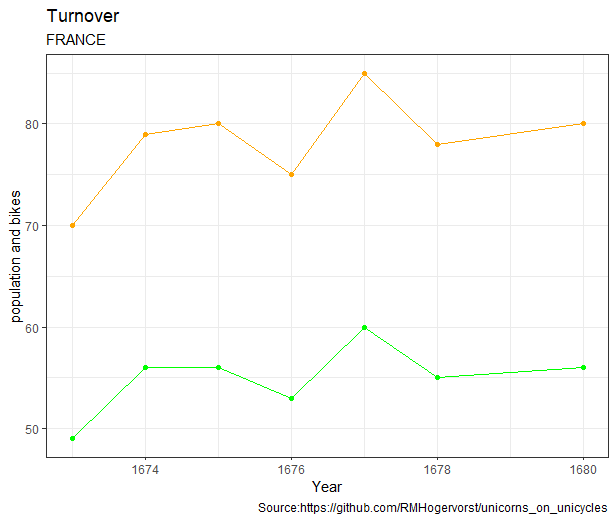


- - - 


```
linerPlotCountryPopBikes <- function(country){
  df <-  df_obs_sales %>% 
    filter(name_of_country == country)
  ggplot() +
    geom_line(data=df, mapping = aes(x=year, y=population), color="orange") +
    geom_point(data=df, mapping = aes(x=year, y=population), color="orange") +
    geom_line(data=df, mapping = aes(x=year, y=bikes), color="green") +
    geom_point(data=df, mapping = aes(x=year, y=bikes), color="green") +
    labs(y = "population and bikes", 
         x = "Year",
         title = "Turnover",
         subtitle = country,
         caption = "Source:https://github.com/RMHogervorst/unicorns_on_unicycles") +
    theme_bw()
}

linerPlotCountryPopBikes("FRANCE") # country smallest pop 
linerPlotCountryPopBikes("SWITZERLAND") ## country largest pop

```

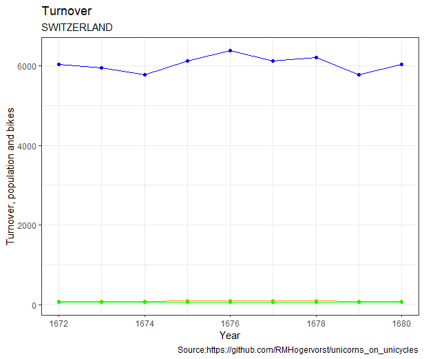

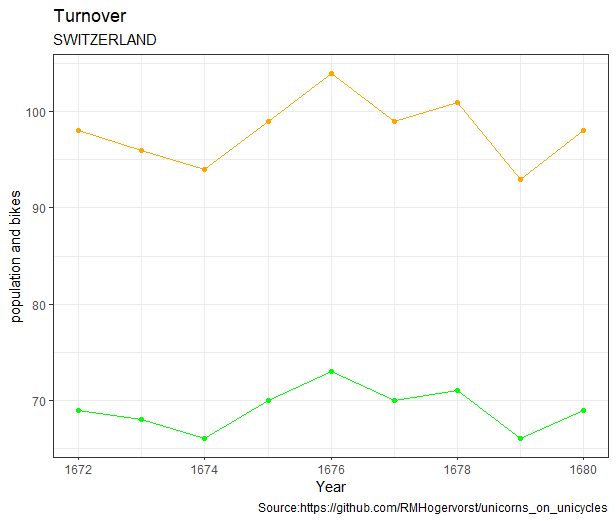


The last four plots talk about, again, in time, how those are interelated (population, number of bikes and total turnover). The second plot for France and Switzerland is like a zoom of the bottom part.

- - -


