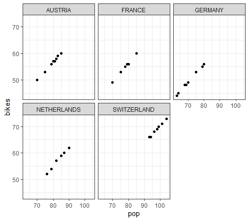

Collaborators:
* Cesar Orozco
* Megan 
* Johan Bastos


# R project. Unicorn and monocycles

based on: https://github.com/RMHogervorst/unicorns_on_unicycles

## Description

The main purpose is to tidy sales and observations tables, get insights and create a story to answer questions.

The tables are about the population of unicorns and the sales of monocycles (yes I know!). As the original author described:

> His work contains multiple tables, carefully written down, documenting the population of unicorns over time in multiple places and related to that the sales and numbers of unicycles in those countries.

and also:

> This 'raw' data gives us a nice example of typical dirty data you would find in the wild. The goal is to combine the sales data of unicycles and the populations of unicorns into a single 'tidy' dataframe.

Tables are:
    - Sales
    - Observations

Everything is from 1600's century, taking place in five countries: Austria, Germany, France, Switzerland , Netherlands.

# Questions

1. Is there any correlation between sales of monocycles and the presence of unicorns?
2. How is the trend of bikes vs the number of unicorns. Growing, slowing down?
3. What was the country with more sales given presence of unicorns? Bigger number of bikes?
4. 
5. Are there any missing years (zero population). What happend in those years?

# Analisys

* All code comes from asignmentV3.R file.


1. Is there any correlation between sales of monocycles and the presence of unicorns?

```
scatterPlotFacetCountries <- function(){
  #### scatterplot  all bikes and pop by country  facet_wrap   ++++++++++++++ with colors and change beauty
  obs_sales_contries <<- observations %>%
    left_join(bike_sales)
  obs_sales_contries %>%
    ggplot(.) + 
    geom_point(mapping = aes(x = pop, y = bikes)) + 
    facet_wrap(~ name_of_country, nrow = 2)  
}
}
```



The facet above pictures the correlation for 5 countries in terms of population vs number of bikes. The evolution is positive.

- - -
```
scatterPlotLinearPlotCorrelation <- function(){
  # scatterplot bikes vs population linear plot correlation
  #  trend line for all countries:   unicorn population vs number of bikes
  pop_bikes_turn <<- observations %>% # create pop_bikes_turn table with joins
    left_join(bike_sales) %>%
    left_join(bike_turnover)
  pop_bikes_turn %>%
    ggplot(.) + 
    geom_point(mapping = aes(x = pop, y = bikes)) +
    geom_smooth(mapping = aes(x = pop, y = bikes))
}
```


- - -
```
scatterPlotLinearPlotCorrelationColors <- function(){
  # scatterplot with trend line for all countries and with clustering colors: 
  #unicorn population vs number of bikes
  pop_bikes_turn %>%
    ggplot(., mapping = aes(x = pop, y = bikes)) + 
    geom_point(mapping = aes(color = name_of_country)) + 
    geom_smooth(data = filter(pop_bikes_turn)) 
}
```


- - -
```
scatterPlotLinearPlotCorrelationColors <- function(){
  # scatterplot with trend line for all countries and with clustering colors: 
  #unicorn population vs number of bikes
  pop_bikes_turn %>%
    ggplot(., mapping = aes(x = pop, y = bikes)) + 
    geom_point(mapping = aes(color = name_of_country)) + 
    geom_smooth(data = filter(pop_bikes_turn)) 
}
```


- - -
```
correlationTable <- function(){
  ############### correlation pop and bikes
  # table with countries, correlation and total_turnover
  cor_turnover_countries <- obs_sales_contries %>% 
    group_by(name_of_country) %>% 
    summarize(correlation = cor(pop, bikes),
              total_population = sum(pop),
              total_bikes = sum(bikes)) %>%
    grid.table(.) 
}
```


- - -
```
```


